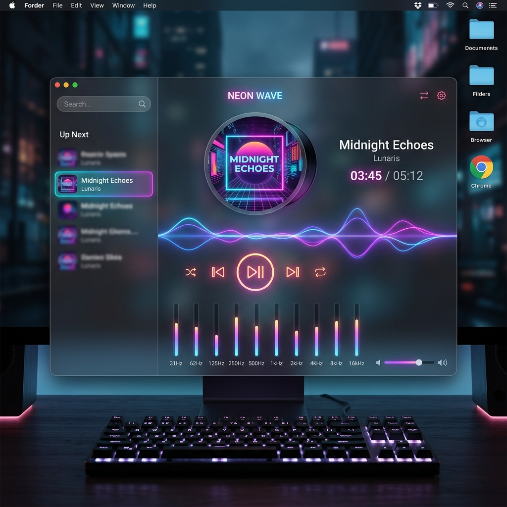

<p align="center">
  
</p>

<h1 align="center">PLY - Premium Glassmorphic Web Audio Player</h1>

PLY is a high-fidelity, premium glassmorphic local audio player running entirely in the browser. Designed with modern aesthetics in mind, it allows users to scan local folders for audio files (`.mp3`, `.wav`), parse ID3 metadata, and play music with responsive canvas visualizers, custom equalizers, and media key integrations.

<p align="center">
  
</p>


## Key Features

- 🎵 **Local Library Scan**: Easily import a folder of music using standard web APIs.
- 🎨 **Glassmorphic Design System**: Supports both dark and light modes, smooth gradients, and beautiful animations.
- 📉 **Real-Time Visualizer**: Interactive canvas drawing glowing frequency bars.
- 🎚️ **5-Band Equalizer**: Adjust acoustic gains (60Hz, 230Hz, 910Hz, 4kHz, 14kHz) with built-in presets (Rock, Pop, Jazz, Classical).
- ⏱️ **Sleep Timer**: Setup custom timers to stop audio, including a premium **5-second soft volume fade-out**.
- 📂 **Media Management**: Create custom playlists, mark favorite tracks, and search.
- 📱 **Media Session API**: Complete background audio playback and macOS lock screen / control center media key support.

## Tech Stack

- **Core**: React, TypeScript, Vite
- **Styling**: Custom CSS Variables, Glassmorphism
- **Audio Engine**: Web Audio API, HTML5 Audio
- **Metadata**: jsmediatags

---

## Getting Started Locally

1. Clone or download the repository files.
2. Install dependencies:
   ```bash
   npm install
   ```
3. Run the development server:
   ```bash
   npm run dev
   ```
4. Open [http://localhost:5173](http://localhost:5173) in your web browser.

---

## Deploying to GitHub Pages (Automatic)

We have configured a GitHub Actions workflow that builds and deploys this app to GitHub Pages automatically on every push to the `main` branch.

### Deployment Instructions:

1. **Create a GitHub Repo**:
   - Go to [GitHub](https://github.com) and create a new public repository (e.g. named `ply`).
   - Do **NOT** initialize it with a README, gitignore, or license.

2. **Add Remote & Push**:
   Run the following commands in your project folder:
   ```bash
   # Add your repository as the origin remote (replace <username> and <repository>)
   git remote add origin https://github.com/<username>/<repository>.git

   # Push the main branch to GitHub
   git push -u origin main
   ```

3. **Configure Pages Settings on GitHub**:
   - On GitHub, navigate to your repository's page.
   - Go to **Settings** > **Pages** (in the left-hand menu).
   - Under **Build and deployment** > **Source**, change the dropdown from **Deploy from a branch** to **GitHub Actions**.

4. **Enjoy**:
   The GitHub Actions workflow will automatically run. Once completed, your app will be live at:
   `https://<your-username>.github.io/<repository-name>/`
